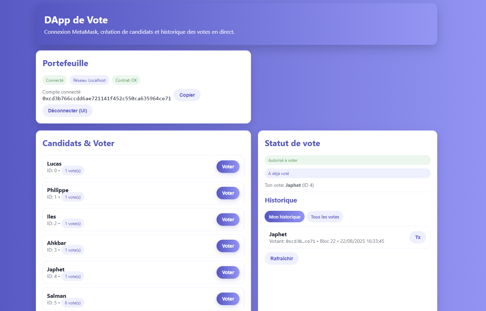
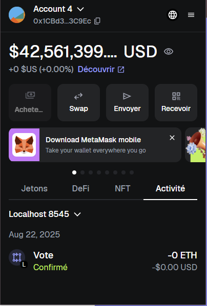
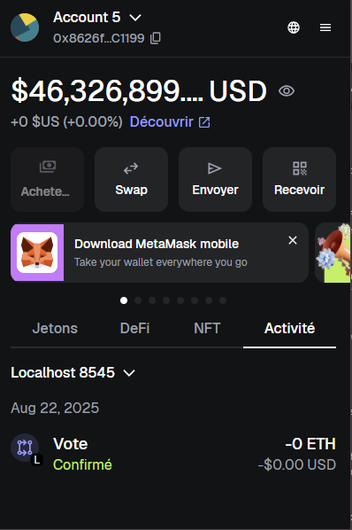

# DApp de Vote – Hardhat + MetaMask

Application de vote décentralisée : connexion MetaMask, création de **candidats** (par l’owner), autorisation des **votants**, vote, et historique on-chain.

* **Contrat** : `contracts/Voting.sol`
* **Déploiement local** : Hardhat (`localhost:8545`, chainId **31337**)
* **Front** : `index.html` (Web3.js)

---

## 🔐 Rôles & “qui a fait quoi”


* **Philippe MBARGA – Lead Smart-Contract**
    * Conception `Voting.sol` (structures, events, `onlyOwner`)
    * Revue sécurité des require et flux `vote()`
    * Revue sécurité (lecture/écriture storage, visibilité, reverts clairs).
      
* **Lucas MESSIA DOLIVEUX  – Smart-Contract Engineer (Tests & Qualité)**
    * Écriture des tests Hardhat/ethers (v6) : couverture des exigences fonctionnelles.
    * Vérification de la compatibilité Solidity 0.8.24 + optimizer.
    * Décisions techniques

* **Iles YAZI – DevOps Hardhat**

   * Configuration de Hardhat : réseau localhost:8545, chainId 31337, toolbox.
   * Scripts de déploiement (ethers v6) et de seed.
   * hardhat.config.ts (optimizer ON, chemins, network localhost), scripts/deploy.js (usage waitForDeployment(), getAddress()), scripts/seed.js (ajout candidats + autorisation d’un votant).
   * Décisions techniques : Standardisation sur le port 8545, procédures Windows (netstat/taskkill) si port occupé.
   * Fichiers: hardhat.config.ts, scripts/*.js.
 
* **Ianis CHENNAF — Intégration Web3 (Front <-> Contrat)**

   * Connexion MetaMask (Web3.js), instanciation web3.eth.Contract(ABI, address).
   * Appels aux méthodes on-chain : owner(), getVoter(), getCandidate(), addCandidate(), addVoter(), vote().
   * Gestion d’erreurs et toasts (snackbar) : messages clairs côté UI.
   * Logique JS du index.html (init, connect, refresh, listeners, confirm)
   * Vote manuel (par ID/nom) + cache candidats.
   * Interrogation candidates par index 0..N jusqu’au revert, simple et robuste pour un POC.
   * index.html (section <script>), intégrations Web3.
 
* **Salman Ali MADEC — Front-End Lead (UI/UX)**

   * Architecture de l’interface : sections Portefeuille, Administration, Candidats/Vote, Statut, Historique.
   * Design système : variables CSS (--primary, --secondary, badges, boutons, responsive).
   * Maquettes (si fournies) + index.html stylé (cards, tabs, grille responsive).
   * Expérience “Administration visible uniquement pour l’owner”.
   * UI simple 1-fichier (HTML+CSS+JS) pour faciliter la revue.
   * index.html (structure/markup + styles).
 
* **Matéo OUDART — Événements & Historique On-chain**

   * Récupération des événements VoteCast via getPastEvents.
   * Récupération des timestamps de blocs pour afficher les dates lisibles.
   * Onglets Mon historique vs Tous les votes.
   * Liste historisée (200 derniers max), lien vers explorer (placeholder).
   * Cache léger + tri côté client par date.
   * JS historique dans index.html.
 
* **Arthur DEUMENI — QA / E2E / Recette**

   * Responsabilités

   * Rédaction d’un plan de test détaillé.

   * Scénarios d’erreurs : Invalid candidate, Non autorisé, double vote, contrat non trouvé.

   * Livrables clés

   * Feuille de test (Google Sheet/Markdown), tickets/bugs remontés et suivis.

   * Décisions techniques

   * Tests manuels multi-comptes MetaMask

   * Fichiers

 * **Grégoire LEROGNON — Documentation & Pilotage**

   * Responsabilités

   * Rédaction du README.md (installation, commandes, dépannage, rôles).

   * Conventions de commit.

   * Roadmap/Milestones, coordination du groupe (10 personnes).

   * Livrables clés


* ***Akbar KHAN *** — Sécurité & Conformité

    * Responsabilités

    * Threat modeling basique : abuse cases (ex. vote par non-autorisé).

    * Recommandations de front : validation d’adresse (regex), vérif de chainId, messages pédagogiques.

    * Bonnes pratiques clés privées (MetaMask) & manip de comptes de test.

    * Livrables clés

    * Section sécurité dans README, check-list de revue.

    * Décisions techniques

    * Pas d’assets de valeur ni de transferts d’ETH dans ce POC.

    * Fichiers

    * Notes sécurité, revue PRs.

* **Japhet Ntantu — Performance & DX (Dev Experience)**
   * Responsabilités
   * Outillage dev : Live Server VSCode, scripts npm, conseils sur ESLint/Prettier (si ajoutés)
   * Micro-perf UI (rafraîchissements raisonnables, intervalle léger de polling)
   * Améliorations DX : toasts cohérents, logs utiles, structure du code JS
   * Livrables clés :
   * Scripts de confort (start, deploy, seed), guidelines de code
   * Décisions techniques
   * Polling soft (15s) + refresh ciblés après tx pour épargner le node
   * package.json (scripts), README (tips dev), JS UI

     


---

## 🎯 Fonctionnalités

* Connexion MetaMask (badges d’état réseau / contrat / compte)
* Panneau **Administration** (visible par `owner()` uniquement)

    * `addCandidate(name)`
    * `addVoter(address)`
* Liste des candidats + vote (boutons et **vote manuel** par ID/nom)
* Statut votant (autorisé / a voté / pour qui)
* Historique : événements `VoteCast` (mon historique / tous les votes)

---

## 🧱 Stack

* **Solidity 0.8.24**
* **Hardhat** (+ ethers v6, toolbox)
* **Web3.js** (front)
* **MetaMask** (réseau local `localhost:8545` – chainId 31337)

---

## 📂 Structure

```
contracts/
  Voting.sol
scripts/
  deploy.js        # déploie le contrat et affiche l’adresse
  seed.js          # (optionnel) crée des candidats + autorise un votant
index.html         # UI complète (MetaMask + Admin + Vote + Historique)
hardhat.config.ts  # config réseau (localhost:8545, chainId 31337)
```

---

## 🚀 Démarrage rapide

### 0) Prérequis

```bash
node -v  # >= 18 recommandé
npm i
```

### 1) Lancer la chaîne locale

```bash
npx hardhat node --port 8545
```

> Hardhat imprime une liste d’adresses **avec clés privées**.
> **Owner = 1er compte** (ex. `0xf39F...92266`).

### 2) Déployer le contrat

```bash
npx hardhat run scripts/deploy.js --network localhost
# => Voting contract deployed to: 0x5FbDB2315678afecb367f032d93F642f64180aa3  (exemple)
```

### 3) Configurer l’UI (adresse du contrat)

Dans `index.html`, remplace :

```js
const CONTRACT_ADDRESS = "0x5FbDB2315678afecb367f032d93F642f64180aa3"; // <-- ton adresse
```

### 4) (Optionnel) Seed (candidats + votant)

**scripts/seed.js** (déjà fourni) :

```bash
# édite scripts/seed.js et mets VOTER_ADDRESS = ton adresse MetaMask
npx hardhat run scripts/seed.js --network localhost
```

ou **console Hardhat** :

```bash
npx hardhat console --network localhost
const [owner] = await ethers.getSigners();
const V = await ethers.getContractAt("Voting","<ADRESSE_CONTRAT>", owner);
await (await V.addCandidate("Alice")).wait();
await (await V.addCandidate("Bob")).wait();
await (await V.addVoter("<ADRESSE_METAMASK_VOTANT>")).wait();
```

### 5) Ouvrir le front

* Ouvrez **`index.html`** dans votre navigateur (via un serveur statique type “Live Server” de VSCode ou double-clic).
* **MetaMask** → réseau **Localhost 8545** (chainId **31337**).
* Connectez-vous avec **l’owner** pour voir la carte **Administration**.
* Créez des candidats, **autorisez** l’adresse qui va voter, puis **votez**.

---

## 🛠️ Commandes utiles

```bash
# Lancer la chaîne locale
npx hardhat node --port 8545

# Déployer le contrat (localhost)
npx hardhat run scripts/deploy.js --network localhost

# Seed (candidats + votant)
npx hardhat run scripts/seed.js --network localhost

# Console interactive reliée au node
npx hardhat console --network localhost
```

---

## 🧩 MetaMask – réseau local

* Réseau : **Localhost 8545**
* **ChainId** : 31337 (Hardhat).

  > Si vous aviez 1337 auparavant, alignez **hardhat.config** et MetaMask.
* Si besoin, l’UI peut forcer l’ajout/switch via `wallet_addEthereumChain` / `wallet_switchEthereumChain`.

---

## 🩺 Dépannage (FAQ)

**“Non connecté / Réseau: Mainnet”**
→ Dans MetaMask, sélectionnez **Localhost 8545** (pas Ethereum Mainnet).

**“Contrat: introuvable”** dans l’UI
→ `CONTRACT_ADDRESS` n’est pas la bonne adresse **de déploiement**.
Redéployez et remettez l’adresse imprimée par `deploy.js`.

**“Non autorisé”**
→ Vous n’avez pas été ajouté via `addVoter(address)`.
Connectez-vous en **owner** (déployeur) → Admin → Autoriser votre adresse.

**`Error: reverted with reason string 'Invalid candidate'`**
→ Aucun candidat à cet ID. Créez des candidats (Admin) ou via `seed`.
Vérifiez `getCandidate(0)` en console.

**`address already in use 127.0.0.1:8545`**

* **Windows** :

  ```bat
  netstat -ano | findstr :8545
  taskkill /PID <PID> /F
  ```
* **macOS/Linux** :

  ```bash
  lsof -i :8545
  kill -9 <PID>
  ```

**Après redémarrage de `hardhat node`**
→ La chaîne est **reset** : **redeploy**, mettez à jour `CONTRACT_ADDRESS`, recréez candidats & votants (ou relancez `seed`).

---

## ✅ Conventions commit (exemples)

* `feat(dapp): UI admin + vote manuel + historique`
* `fix(contract): revert si candidateId invalide + tests`
* `chore(hardhat): seed script + switch network helper`
* `docs(readme): guide d’installation & rôles équipe`

---

## DEMO des votes






## 📜 Licence

MIT — voir `LICENSE` (ou la licence de votre choix).

---

